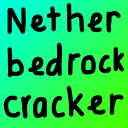
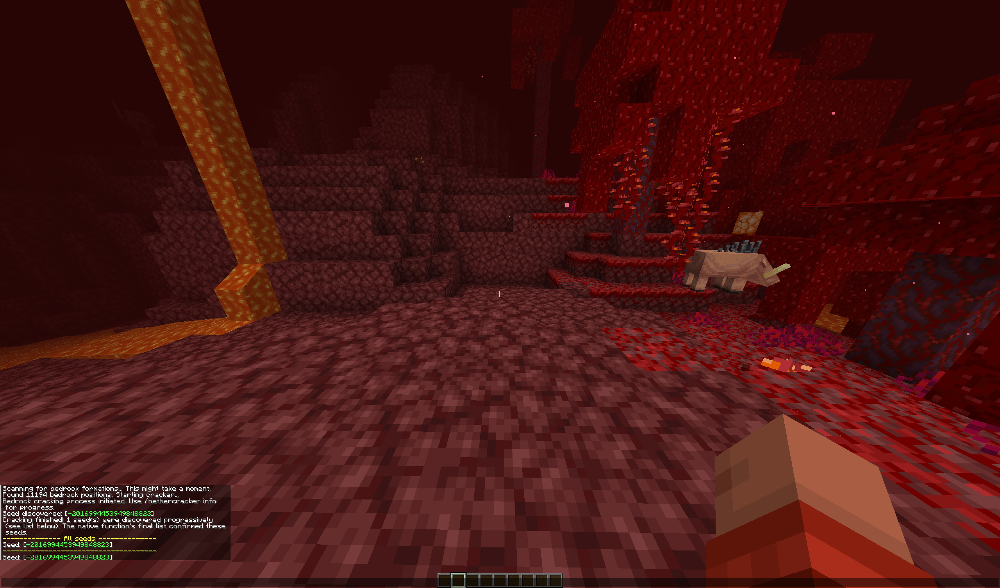

<div align="center">
  
</div>
<h1 align="center">Ingame Nether Bedrock Cracker</h1>

This mod is base on [Nether_Bedrock_Cracker](https://github.com/19MisterX98/Nether_Bedrock_Cracker) by [19MisterX98](https://github.com/19MisterX98)

# IMPORTANT
You need to add `--enable-preview` into the Java arguments of your launcher.

- Almost launcher: `Settings` -> `Java` -> `JVM arguments`
- Pojav launcher: `Settings` -> `Java Tweaks` -> `JVM Launch arguments`

If you use MultiMC or PrismLauncher, you can only add to the instance you use the mod:

`Select Instance` -> `Edit` -> `Settings` -> `Java` -> `Java arguments`

# Commands:
- `/nethercracker start` start cracker
- `/nethercracker info` get infomation of running progress
- `/nethercracker stop` stop cracker
- `/nethercracker get` get list of bedrock coordinates at y=4 and y = 123

# Example


# Build with source
1. Set up enviroment
- Install JDK 21
- Install [rust](https://www.rust-lang.org/tools/install)
- Install LLVM

2. Clone repository
```
git clone https://github.com/tmquan2508/ingame-nether-bedrock-cracker.git
cd ingame-nether-bedrock-cracker
git submodule update --init
```

3. Build jextract
```
cd jextract
./gradlew -Pjdk21_home=$JAVA_HOME -Pllvm_home=$LLVM_HOME clean verify
```

4. Build native lib
```
cd ../
cd src/main/nbc
cargo build --release
```

5. Build the mod
```
cd ../../../
./gradlew build
```
